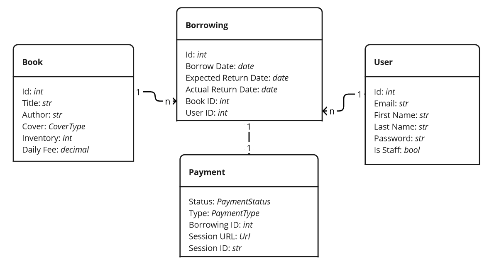

# Library-Service
Group project of students of the mate-academy
## Overview
API service for library management written on DRF
This project is a library management system designed to handle
book inventory, user management, borrowing transactions,
notifications, and payments. It integrates with Stripe for 
payment processing and Telegram for notifications.

## Participants:
- Yaroslav Kondrattsev
- Dmytro Sokolovskyi
- Ivan Vahanov
- Danylo Roh
- Andrii Fedorov
- Serhii Musiienko

## Installing using GitHub
Install PostgresSQL and create db
```
git clone 
cd planetarium_API
python - m venv venv
sourse venv/bin/activate
pip install - r requiments.txt
create correct .env file from .env.sample
python manage.py migrate
python manage.py runserver
```

## Run with docker
Docker should be installed.
You should create correct .env file from .env.sample
```
docker-compose build
docker-compose up
```
Access the application: Open your browser and go to http://localhost:8000

## Getting access
- **creating user via /api/user/register/**
- **get access token via /api/user/token/**

## Features
- **JWT authentification**
- **Admin panel /admin/**
- **Documentation is located at /api/doc/swagger/**
- **Books Service**: Manage book inventory with CRUD operations.
- **Users Service**: Handle user authentication and registration.
- **Borrowings Service**: Manage book borrowings, including creation, retrieval, and return.
- **Notifications Service**: Send notifications about borrowings and overdue items via Telegram.
- **Payments Service**: Handle payments for book borrowings through Stripe.
## Resources

### Book
- **Title**: `str`
- **Author**: `str`
- **Cover**: Enum: `HARD` | `SOFT`
- **Inventory**: Positive `int` (Number of books available in the library)
- **Daily Fee**: Decimal (in $USD)

### User (Customer)
- **Email**: `str`
- **First Name**: `str`
- **Last Name**: `str`
- **Password**: `str`
- **Is Staff**: `bool`

### Borrowing
- **Borrow Date**: `date`
- **Expected Return Date**: `date`
- **Actual Return Date**: `date`
- **Book ID**: `int`
- **User ID**: `int`

### Payment
- **Status**: Enum: `PENDING` | `PAID`
- **Type**: Enum: `PAYMENT` | `FINE`
- **Borrowing ID**: `int`
- **Session URL**: `Url` (URL to Stripe payment session)
- **Session ID**: `str` (ID of Stripe payment session)
- **Money to Pay**: Decimal (in $USD)

## Components

### Books Service
- **API Endpoints**:
  - `POST /books/` - Add a new book
  - `GET /books/` - List all books
  - `GET /books/<id>/` - Get details of a specific book
  - `PUT/PATCH /books/<id>/` - Update a book (including inventory management)
  - `DELETE /books/<id>/` - Delete a book

### Users Service
- **API Endpoints**:
  - `POST /users/` - Register a new user
  - `POST /users/token/` - Get JWT tokens
  - `POST /users/token/refresh/` - Refresh JWT token
  - `GET /users/me/` - Get profile information of the current user
  - `PUT/PATCH /users/me/` - Update profile information

### Borrowings Service
- **API Endpoints**:
  - `POST /borrowings/` - Create a new borrowing (decreases book inventory by 1)
  - `GET /borrowings/?user_id=...&is_active=...` - List borrowings by user ID and active status
  - `GET /borrowings/<id>/` - Get details of a specific borrowing
  - `POST /borrowings/<id>/return/` - Set actual return date (increases book inventory by 1)

### Notifications Service (Telegram)
- **Functionality**:
  - Notifications about new borrowings, overdue items, and successful payments.
  - Uses Telegram API, Telegram Chats & Bots.
  - Implemented as a parallel cluster/process (Django Q or Django Celery).

### Payments Service (Stripe)
- **API Endpoints**:
  - `GET /success/` - Check for successful Stripe payment
  - `GET /cancel/` - Handle payment cancellation

## Architecture diagram

Here is the architecture diagram for the project:

